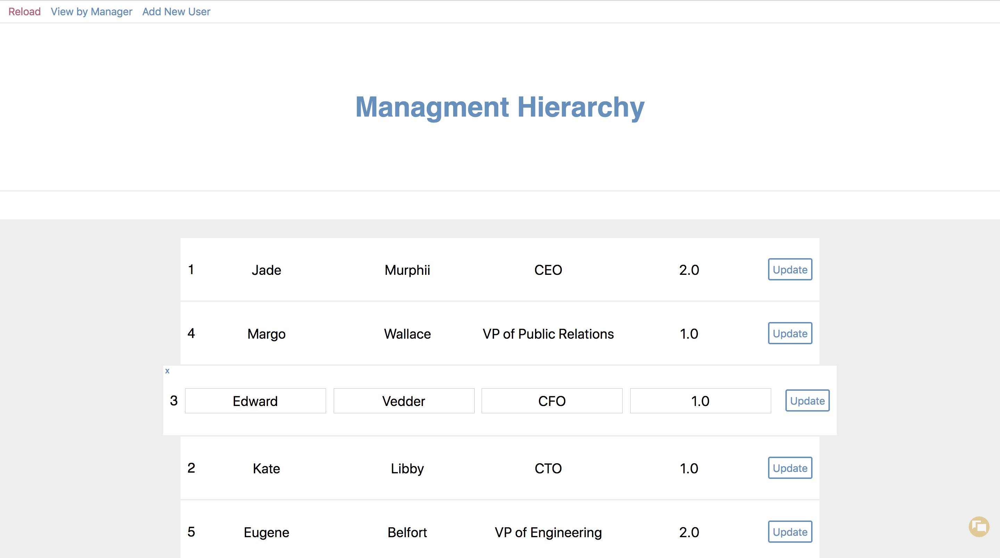

# Rhabit-Exercise
- Job interview assignment for Rhabit company.

## Description
"Web-API and a simple front-end experience that allows users to create, read, update, and destroy organizational relationship data that would be used to build an organizational chart." Take home technical assignment for company Rhabit, to be worked on from 3.25.18 to 3.28.18.

# General
## The Assignment
### What is expected to be supported:
- Adding a new user not included in the pre-populated dataset.
- Removing an existing user.
- Updating an existing user.
- Returning an entire organization’s relationships (as a  nested  JSON
object).
- Returning a subsection of an organization's relations, e.g. a manager.
and all of their direct reports (as a  nested  JSON object).

### User properties given:
| ID | First Name | Last Name | Title | Manager ID |
| --- | --- | --- | --- | --- |
| 1 | Jade | Murphy | CEO | null |
| 2 | Kate | Libby | CTO | 1 |
| 3 | Edward | Vedder | CFO | 1 |
| 4 | Margo | Wallace | VP of Public Relations | 1 |
| 5 | Eugene | Belfort | VP of Engineering | 2 |
| 6 | Richard | Gill | Public Relations Manager | 4 |
| 7 | Emmanuel | Goldstein | Lead Software Engineer | 5 |
| 8 | Paul | Cook | Software Engineer | 5 |
| 9 | Joey | Pardella | Junior Software Engineer | 8 |
| 10 | Agnes | Pardella | Project Manager | 4 |
| 11 | Ramon | Sanches | Software Engineer | 8 |

## Deployment instructions
### Rails
- $ cd ./project/organization-api
- $ rails s -p 3001
- http://localhost:3001/api/v1/users
### Reactjs
- $ cd ./project/organizationapp
- $ npm start
- http://localhost:3000

## Database creation/initialization
- $ rails new --api organization-api
- $ cd ./project/organization-api
- $ rails generate model User first_name:string last_name:string title:string manager_id:numeric
- $ db:migrate
- Update seed file with data
- $ rails db:seed

## Reactjs creation/initialization
- $ npm install -g create-react-app
- $ create-react-app organizationapp

## Ruby version
- 5.1.3

## Example Images (03/28/18)
| O.P | Panel | |
| --- | --- | --- |
| `PC/MAC` | Exercise Main |  |

### Updated: 03/28/18
